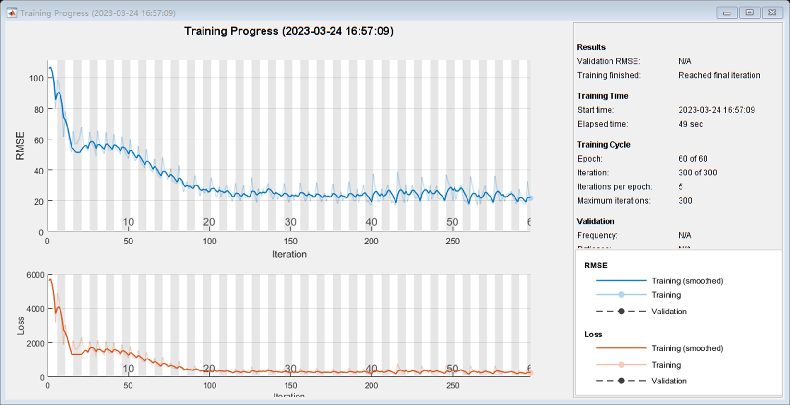
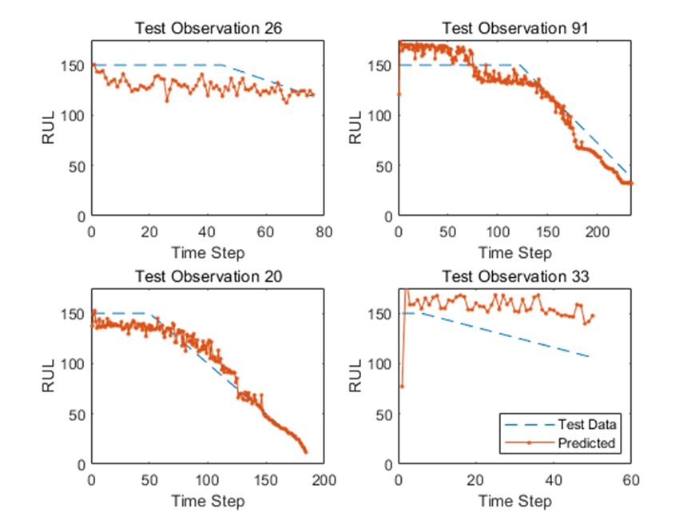
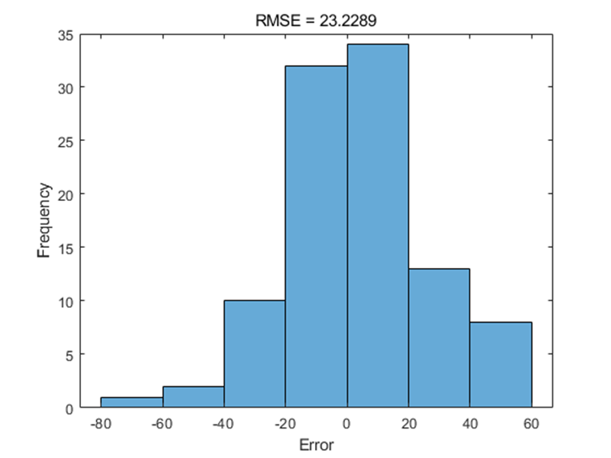
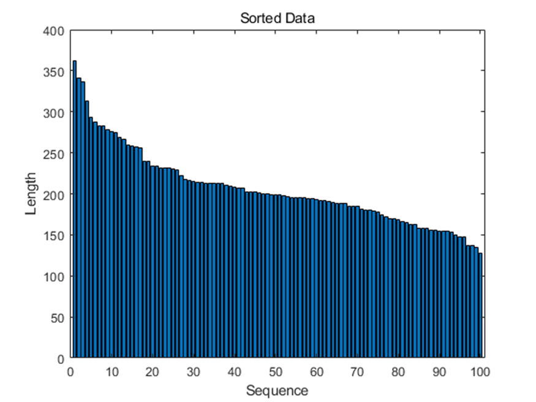

# Predicting the Remaining Life of NASA turbofan engine degradation dataset using deep learning in MATLAB

The program is run on MATLAB R2018a, and it predicts the remaining lifespan of NASA turbofan engine degradation datasets based on deep learning. The package includes both code and data.

Please note:
1. All the code has been tested and no issues found.
2. Please read the project description carefully before purchasing, as it involves different programming languages (Python or MATLAB).
3. The program is a special product, and returns are not accepted after purchase. If you have any questions, please contact us in time.
4. This code will not be explained.

## Images

Here is a pay link on Stripe ( https://buy.stripe.com/3cs8yP7sY87d0vu9AB ). Please contact me lonlonago@foxmail.com after funding $89, and I will send you a complete data files , thank you!

